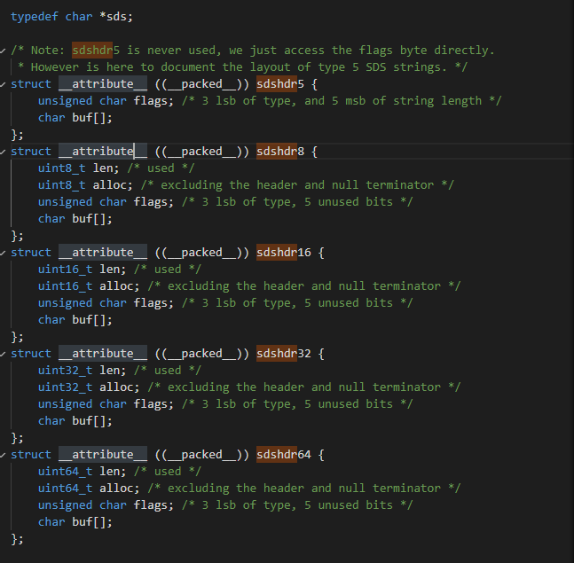
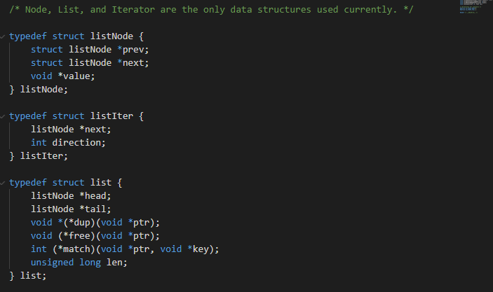
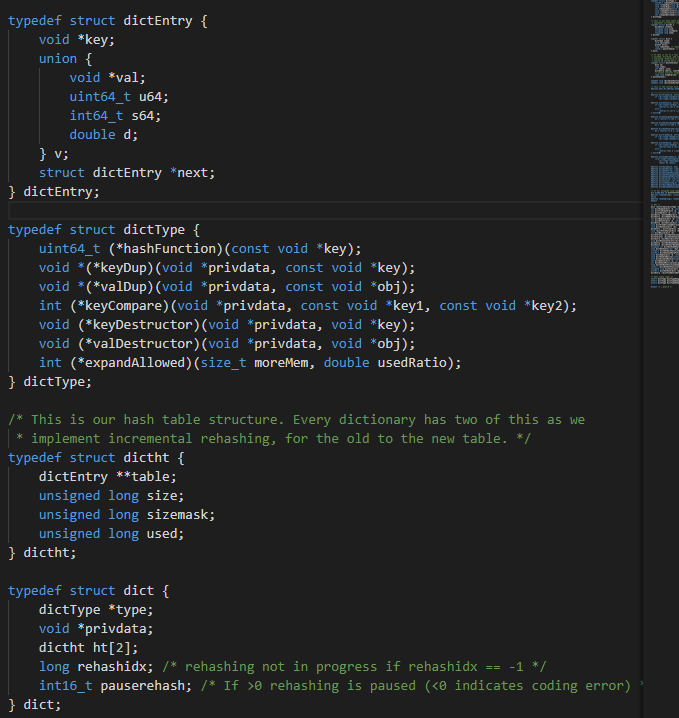
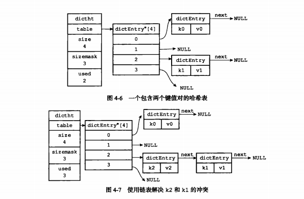
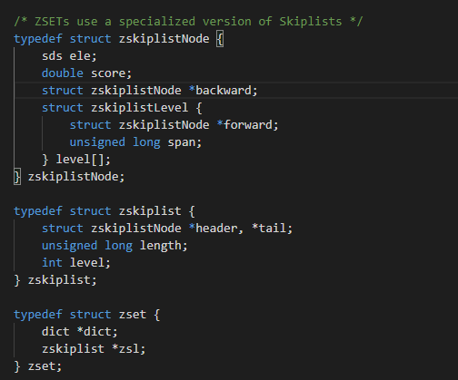
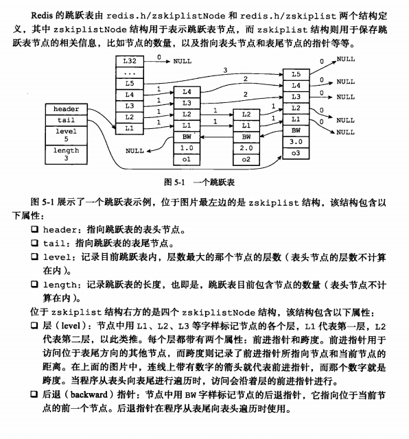
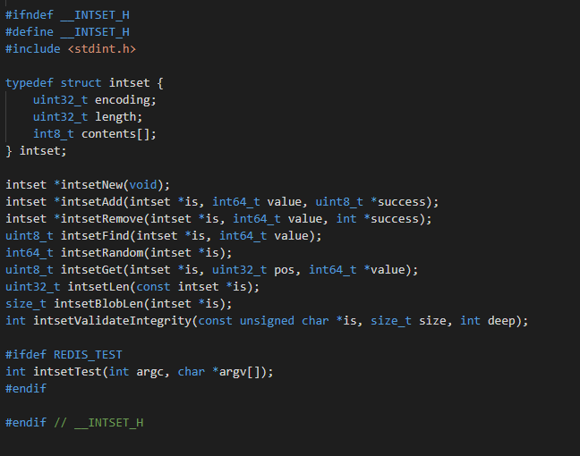
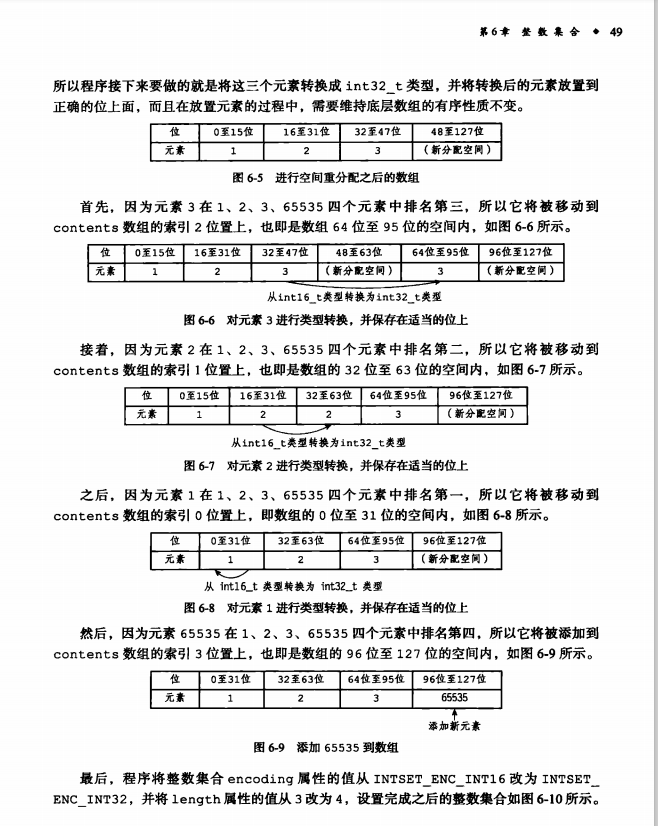

# 数据结构
## 字符串

redis的底层字符串并不是c的字符串而是sds结构在sds.h。

主题部分位使用过的长度和free长度以及buff。看完了相关介绍设计总结如下。

1. redis如果遇上频繁的修改value的情况，那么则需要不断的分配内存进行修改，而这种预分配虽然会浪费一定的空间，但是可以可以减少系统调用的次数。
2. 可以O(1)的知道字符串长度，书上是这么说的，因为他说c的string需要扫描整个字符串才知道长度，是不是傻不知道。
3. 字符串遇到文本数据还ok，遇到图像声音以及二进制或者其他奇怪格式的数据，没办法避免\0的存在。所以不能适应所有数据，所以需要基于ASCII编码，是二进制安全。而sds也会使用\0结尾，这样转化string方便。

你创建一个string类型会生成一个key和value，那么key和value就是sds类型。而如果是队列lpush key 'a' ,'b','c'那么就会生成3个sds类型的数据。

### think
其实与分配的策略在很多地方很常见，在c++中stl的vector，Java中hashmap的hash槽。这些东西都有的特质是经常改变且追求效率。

## 链表

redis的list是基于链表的。链表真tm的离谱这玩意，我不知道为啥很反感他。他的数据结构在adlist.h

简单来说就一个双向链表，带头尾，有3个函数指针dup free match。函数指针有啥好处了，可以说这是个很骚的东西，我把它理解为一种牛逼的范型，只要符合他形式传入就行，你比如我要设计一个测试排序速度的函数，我每一个只需要记录开始和结束呀，所以没必要每一个函数都在靠头结束加上，我们可以使排序的函数符合一个形式，然后传入，进行比较。这个形式和aop的srouing很像，不过实现原理不同。他这个里面是根据函数符号直接找到代码片进行执行的。

## 字典（map）

说实话看着头有点昏和一些不清楚得点。

递进关系dict -> dicth->dictEntry

dictType有很多的函数指针，有基本都是写对比呀，比较啊复制啊，为多态服务。

privdata得意思好像是每个对象私有的一些东西，不太清楚。

而ht则是前面的dicth。里面主要包含一张table和大小和用了多少个。
size是hash表大小，sizemask是hash得掩码也就是决定槽得那个东东，然后used是指已经有多少个。

而每个dictEntry都是有key 和value以及下一个值。字典的形式是key field value。应该是每一个key有一个dict因为有type这玩意，所以不方便得说。但是那个二维的dictEntry硬是感觉有点怪。

这个二维意义在哪里，如果第二个维度的数据都有next指针。等以后读到其他的代码时候在看看。

他有几个重要的东西

1. 扩展与缩小。
既然是hash肯定有扩展得时候，这里就体现了dh[2]的作用了，2种方式扩展一种是停下来，一种是边执行边扩展。
* 停下来扩展就是停下把表变大1倍或者缩小。然后将dh[0]数据复制到dh[1]然后交换。
* 上面如果是500w数据就会很难受，这个时候就可以2个表同时使用，到了一定的时候就会启动他，然后2个表都会有数据，dh[0]找不到去dh[1]找。rehashidx=0表示开始，然后每次使用过程中发现了一个键值对就转移，然后知道所有的结束后rehashidx设置为-1.

## skiplist

这玩意看过大概的意思是第一个header很高，然后其他的层数随机生成，然后记录一个level最高层数，然后进行跳跃。这里的跨度是2个跳跃的距离很容易可以知道跳跃的跨度越大，那么之间的差距越大，如果跳去的地方不小了继续从他那里跳。如果小了，必须回到起点应该。

## numberset

他这里难点在升级上，这里的int8_t会升级的。所以会不断地改变，比如1，2，3是16位储存的话，出现了比16范围大的数字那么必须进行扩展了，数字如65535，所以放到了32位，那么空间变大了，32*4但是之前只有16位所以需要进行转移，

这个过程理解了一会，他是需要将原来的元素加入新的元素，原来的元素在内存中表现为16位转移的时候如果简单的memcpy他还是16，所以需要来定义这些东西。有可能我的理解也不太行。